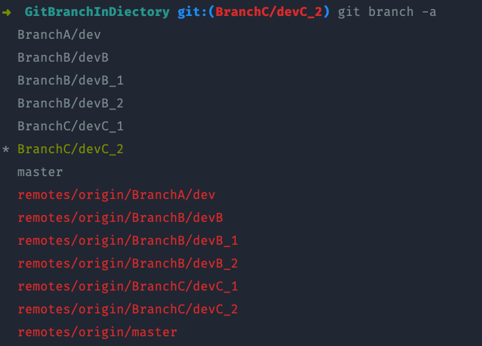

# git 仓库分支多文件夹管理


分支是 git 管理的一大特性，在多人开发大型项目中，经常遇到分支很多，且很多分支需要暂时保留的情况，可以考虑使用文件夹管理不同特性的分支。

> 经过测试，git branch 创建分支命令支持 路径/分支名 这种形式，且能够将路径一同推送到远端。

如下图所示：




git 命令如下：

```
// 创建并切换到分支 branchName
git checkout -b [path]/[branchName]
// 将当前新创建的分支推送到远端
git push origin [path]/[branchName]
```


